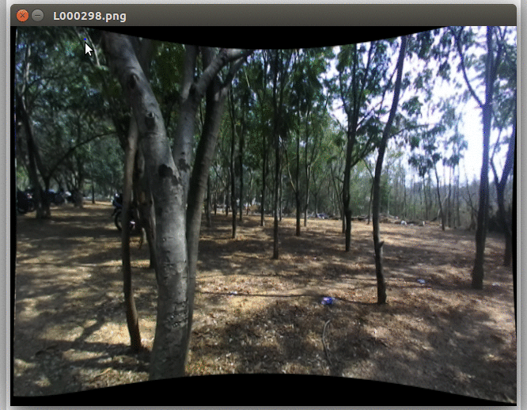

# imgSeqLabelTool
imgSeqLabelTool is specifically made to label/annotate image sequences using bounding boxes. There are other tools present that allow labeling images, but when you have thousands of images the task gets exhausting very quickly.

This tool exploits the similar structure in consecutive frames of a continuous sequence of images. Instead of the user labeling all the images manually, imgSeqLabelTool provides a way to get away with labeling a minimum amount of images.

You start by providing bounding boxes for a frame and using dlib's trackers the tool tracks your objects to the next frame. Simple, right?

If you are not satisfied with the tracker's output, you can provide new bounding boxes for the tracker to track from that frame onwards. If you are satisfied with the tracker's bounding boxes, which happens in 4/5 cases, with just a single key press you can save the annotation and move on to the next frame in a flash.



Reference-style: 

### Contents
1. [Setup](#setup)
2. [Getting Started](#getting-started)
3. [Stats and Comments](#stats-and-comments)
4. [Future Improvements](#future-improvements)

### Setup
Prerequisites:

[python](https://www.python.org/)
[OpenCV](http://opencv.org/)
[numpy](http://www.numpy.org/)
[dlib](https://pypi.python.org/pypi/dlib)


### Getting Started
After you have installed the pre-requisites, let's begin using imgSeqLabelTool.

First, we would want to ensure that you have a folder that holds all the images you wish to label and a directory for storing their corresponding annotation files. This repository has stored the images in the [`frames/`](https://github.com/ankitdhall/imgSeqLabelTool/tree/master/frames) folder and the anotated files in the [`annotations/`](https://github.com/ankitdhall/imgSeqLabelTool/tree/master/annotations) folder (duh!).

> Since you'd want to exploit the structure in consecutive frames, make sure
> your images are named (incrementally) in the order that they are captured to 
> get best results. 

Now that we have all the folder setup, just add them to the function call in the [`imgSeqLabelTool.py`](https://github.com/ankitdhall/imgSeqLabelTool/blob/master/imgLabelTool.py),
```python
if __name__ == '__main__':
    # pass the ("path/to/img/directory", "path/to/annotation/directory", "image_extension", "image_index_to_begin_from")
    a = annotate("frames/", "annotations/", "png", 0)
    a.viewer()
```

Once you have added your paths to [`imgSeqLabelTool.py`](https://github.com/ankitdhall/imgSeqLabelTool/blob/master/imgLabelTool.py) you are ready to begin.
```shell
python imgSeqLabelTool.py
```

### Usage
There are a couple features that come with `imgSeqLabelTool`. Hopefully, there will be more additions in the future. Make sure the image window is active while executing these commands.

* To begin, `press n` on the first image
* Draw bounding boxes by clicking and dragging. You should see your labels overlayed on the image.
* Once you are done with labeling the boxes, `press m` to tell the tool that you've *marked* the boxes and that it can now begin tracking them and proceed to the next frame.
* The next frame will show you the proposed boxes by the tracker, if you like them, `press m` and move to the next frame. Otherwise, you can `press n` if you are *not happy* and reset the boxes, providing new ones yourself.
* If you are unhappy with a box that you drew, `press e` to *erase* the latest box drawn by you.
* Each time you `press m` the annotations for the file are saved automatically (refer to [`to_xml.py`](https://github.com/ankitdhall/imgSeqLabelTool/blob/master/to_xml.py)).
* To *quit*, `press q`

In summary,

Key press | function         
--------- | -------------------------------
`press n` | reset boxes, when *not happy* by boxes provided by the tracker (at the beginning of each image)
`press m` | tell `imgSeqLabelTool` that you have *marked* the boxes, save annotation and move to next image
`press e` | *erase* the latest box that you made
`press q` | *quit* `imgSeqLabelTool`

### Stats and Comments
I had tried several annotation tools before but there was none that had the feature of tracking over consecutive frames, especially when the data was structured that way. Having to label thousands of images when there clearly was structure waiting to be exploited didn't feel right. `imgSeqLabelTool` helped me increase my speed by ~4x-5x. I had to label only very few images as the rest would be taken care by the awesome [dlib correlation tracker](http://blog.dlib.net/2015/02/dlib-1813-released.html). The tool was used to label a specific dataset for a single object category. On an average the annotators had to label only 1 in every 5 images. Obviously, this depends on several factors,

1. The dataset; how clear are the images and are the objects two close/overlapping each other?
2. Continuity between images; a smooth transition would require even less amount of human labeling, making it faster
3. How familiar are the annotators to the interface? Given it's a very minimal interface, one might expect annotators to take a little more time to familiarize themselves with it initially.

Before using dlib's tracker I was using OpenCV's tracker. Using colors(HSV) as features for the [CamShift and MeanShift](http://docs.opencv.org/3.2.0/db/df8/tutorial_py_meanshift.html) algorithms, it doesn't generally work well in the wild. The correlation tracker from dlib worked almost perfectly.

I was curious how fast was this tool in exploting the structure from contiuous frames in comaprison to other tools that don't do this. Annotators used both tools and the average time taken in each case is summarized below.

Tool used         | Average time taken         
----------------- | -------------------------------
`imgSeqLabelTool` | 300 images/hour
 other tool       | 50 images/hour

Obviously, there is some bias here. Time taken could be affected by which tool was used first or if the annotators used the tools in quick sucession making them slower or feel worn out (and several other hypotheses, some of the ones discussed above).

### Future improvements
Currently, imgSeqLabelTool supports writing annotation files only for a single object class. It would also be useful for some users to obtain annotation in various formats, especially a comma or space-separated .txt file.

- [ ] support multi-class label writing to annotation file
- [ ] support `.txt` format
